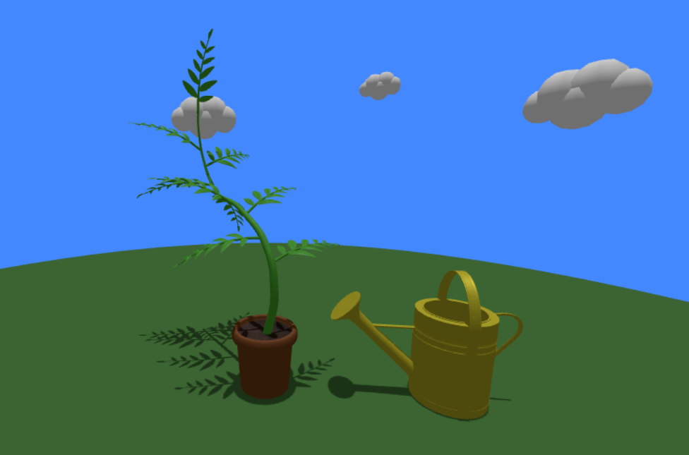
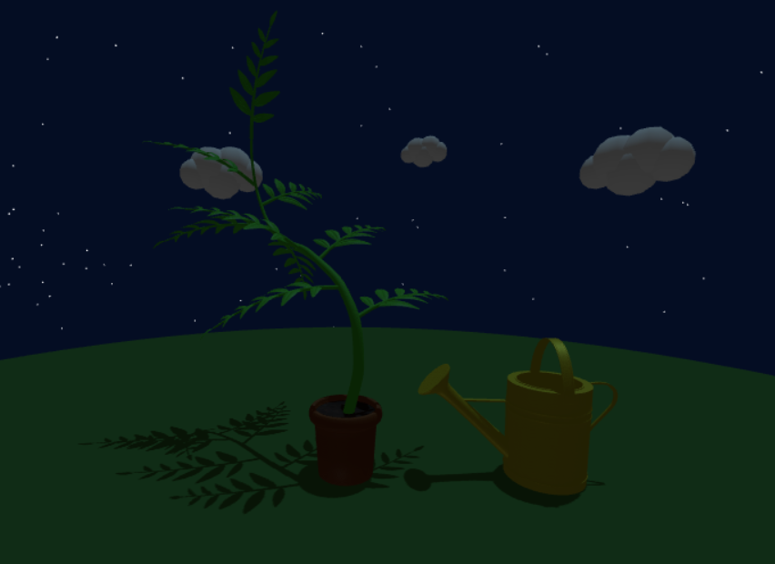

# 3D Garden Web App

### An Interactive Garden Scene Rendered with Three.js

## Features

- Interactive 3D environment
- Plant watering interaction
- Dynamic day/night cycle
- Real-time lighting and environment changes
- Browser-based 3D rendering

*(See <a href="https://beanboot.github.io/3d-web-app/about.html">about</a> page for more details)*

## Technology

- **Language:** JavaScript
- **3D Library:** Three.js
- **Frontend:** HTML, CSS, Bootstrap
- **3D Software:** Blender
- **3D Models:** GLTF / GLB
- **Version Control:** Git

## Development

The project was developed as a browser-based 3D application using **Three.js**, with the scene, camera, lighting, models, and user interactions managed through JavaScript.

The garden environment was constructed from three main 3D models and configured within a Three.js scene. Lighting and environmental conditions change throughout the day to create a dynamic day/night cycle.

User interaction was implemented to allow the plant to be watered directly within the 3D environment. The application handles user input and updates the scene accordingly.

